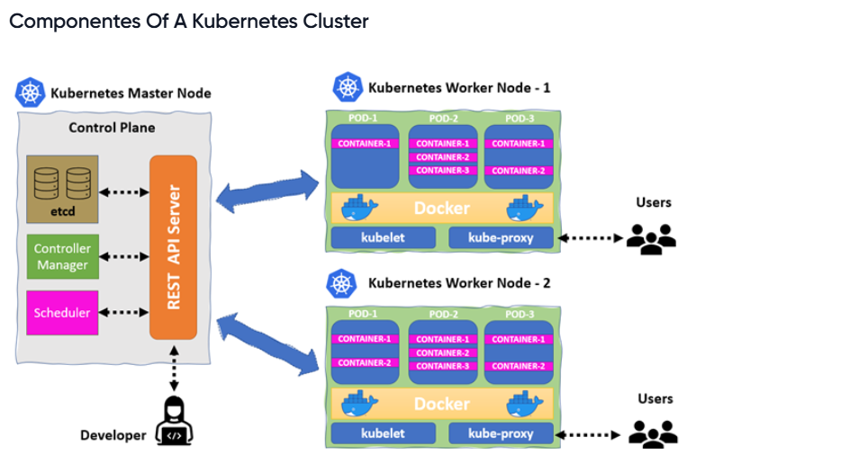
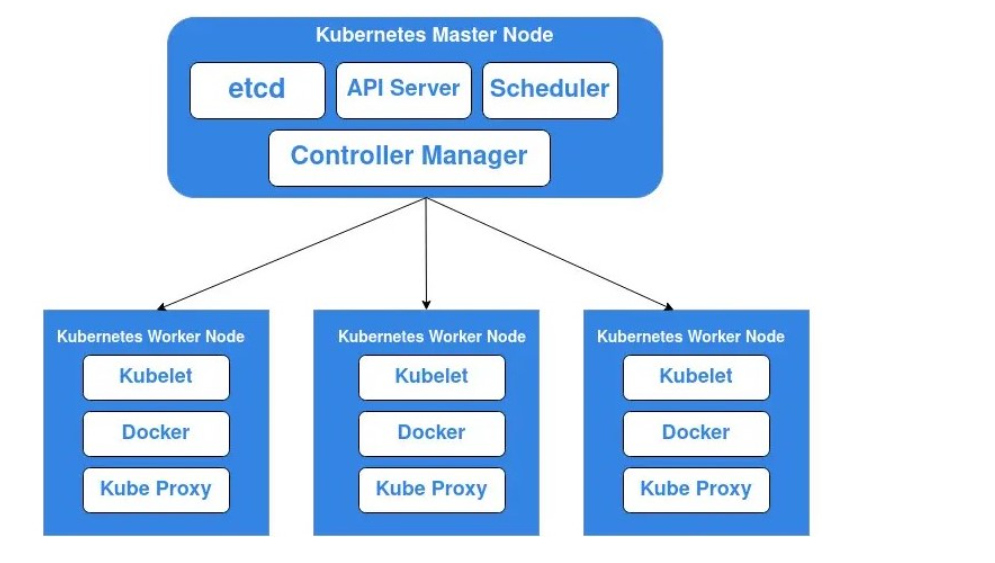
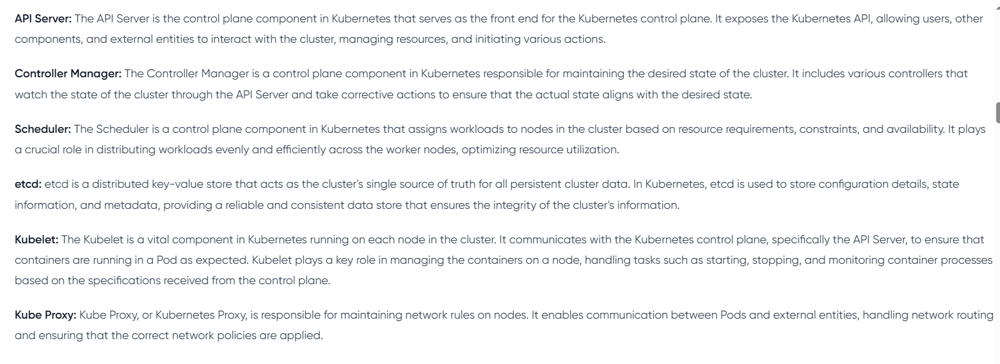
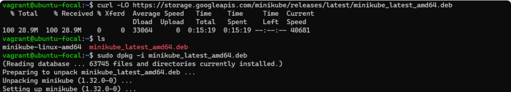
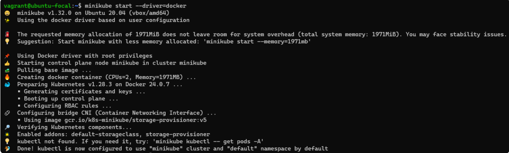

# mini-project--setting-up-minikube

# COMTAINER ORCHAESTRATION WITH KUBERNETES

Kubernetes is an open source container orchestration platform, that automates the deployment, scaling, and management of containerized application. 

## i. Control plane or Master Nodes: 
This the main brain of Kubernetes cluster. It manages the cluster, making high-level 
 decision about the state of teh system. Components like the API server, scheduler, etcd, control panel constitutes the control plane.

 ## ii. Nodes: 
 These are individual machine within the kubernetes cluster responsible for running containerized applications. Ecah node is equipped with a container runtime e.g docker, a kubelet (communicates with the master and manages container on the nodes), and a kube-proxy (maintains network rules). Nodes executes and manage container, distribues workloads,and communiactes with the control plane to mainitain the desired state of the system.

 ## iii. Pods:
 Pods are the fundamental deployment units in kubernetes, representing one or more closely related containers that share the same network namespace, storage and set of specification. Containers within a pod work together and are schedule to work on the same node.

 ## iv. Containers:
 This encapsulates and package applications, along with there dependencies and runtime environment, ensuring cinsistrncy accross various computing environments. In kubernetes containers are organised into pods, the smallest deployable units.

 

 

 # MINIKUBE

 Minikube is an open source tools that enables us to run kubernetes cluster locally on our  machines.
 
 ## GETTING STARTED WITH MINIKUBES:

 ### INSTALLING MINIKUBE ON LINUX:

 ii. Launch a terminal with administartive access.

 ii. We need to install Docker as a driver for minikube and also for minikube to pull base images for kubernetes cluster.

 `` sudo apt-get update``

 This is a linux command that refreshes the package list on Debian.base system, ensuring latest software is available for installation.

 ``sudo apt-get install ca-certificates curl gnupg``

This is a linux command that install essential packages including certificate autorities.

``sudo install -m 0755 -d /etc/apt/keyrings``

This command creates a directory (/etc/apt/keyring/) with specific permission (0755) for storing keyring files, which are use for Docker authentication.

``curl -fsSL https://download.docker.com/linux/ubuntu/gpg | sudo gpg --dearmor -o /etc/apt/keyrings/docker.gpg``

This downloads the Docker GPG using curl

``sudo chmod a+r /etc/apt/keyrings/docker.gpg``

This sets permission for all users on the Docker GPG keyfile within APT keyring directory.

### Lets add the repository APT source

``echo \
  "deb [arch=$(dpkg --print-architecture) signed-by=/etc/apt/keyrings/docker.gpg] https://download.docker.com/linux/ubuntu \
  $(. /etc/os-release && echo "$VERSION_CODENAME") stable" | \
  sudo tee /etc/apt/sources.list.d/docker.list > /dev/null``

  ``sudo apt-get update``

  ### Install latest version of Docker.

  ``sudo apt-get install docker-ce docker-ce-cli containerd.io docker-buildx-plugin docker-compose-plugin``

  ### Verify that Docker has being successfully installed.

  ``sudo systemctl status docker``

  ### iii. Install minikube

   ``curl -LO https://storage.googleapis.com/minikube/releases/latest/minikube_latest_amd64.deb``

``sudo dpkg -i minikube_latest_amd64.deb``

The above commands install minikube´s binary and install minikube using dpkg.

### iv. Start minikube

``minikube start --driver=docker``

### v. Install Kubectl 

kubectl is a command line interface for interacting with and managing kubernetes cluster, allowing users to deploy, inspect and manage application within kubernetes environment. 

``sudo snap install kubectl --classic``

a. start minikube cluster:

``minikube start``

b. stop minikube cluster:

``minikube stop``

c. Delete minikube cluster:

``minikube delete``

d. View nodes:

``kubectl get nodes``

e. Inspect Nodes:

``kubectl describe node <node-name>``

f. List pods:

``kubectl get po -A``

g. Inspect a pod:

``kubectl describe pod <pod-name>``

h. Delete a pod:

``kubectl delete pod <pod-name>``

